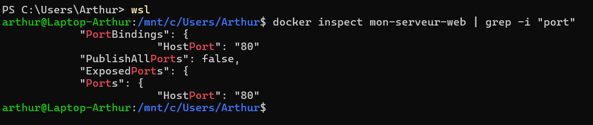
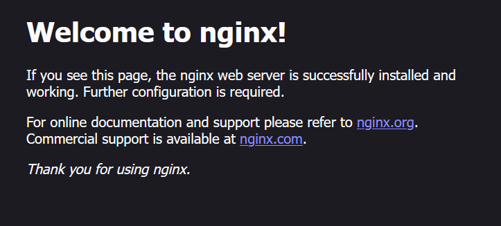

Noms des auteurs :  Arthur, Noah, Gaylor
Date de réalisation : 07/03/25


## 1. Premier container

### 1.1. Hello World 

Pouvez-vous expliquer avec vos mots ce qui s'est passé suite à l'exécution de cette commande? 

Quand on exécute la commande "docker run hello-world", un docker se télécharge et s'exécute dans un docker container.

### 1.2.  Observer un container


Retrouvez les informations suivantes sur le container lancé précédemment : 
1. Quel est son identifiant ? 

| 16c07eabac1fc6ae35f2d371e219acf154495accb371ae514423989642ad8e77

2. Quel est son nom ? 

| infallible_heyrovsky

3. Quel est son état ? 

| Exited

4. Quel est le nom de son image?  Avez-vous vu au point 1.1. d''où cette image provenait?  

| hello-world

5. Quelle commande le container a-t-il exécuté? 

| aucune

6. Si vous avez installer Docker Desktop, pouvez-vous retrouver ces mêmes informations dans l'interface graphique? 

| oui

### 1.3. Les images 

1. Quelles informations voyez-vous?  Quel est le lien avec ce que vous avez observé auparavant? 

| La commande montre les images installé sur le pc

2. Comparez l'output de cette commande avec la vue correspondante de l'interface graphique.  

| Même infos mais montré différement 

3. Essayez de trouver la commande qui vous permettra de supprimer cette image.  C'est une bonne idée de ne pas conserver les images non utilisées sur votre système de fichiers : même avec la mutualisation de couches, elles prennent de l'espace sur le disque! 

| D'abord supprimer le.s container.s utilisant l'image à supprimer.  
docker rmi <nom de l'image>

## 2. Utiliser un container

### 2.1. Interagir avec un container

1. A quoi servent les options ```i``` et ```t```dans la commande ci-dessus? 

| 'i' permet de garder le container ouvert avec les stdin et le 't' permet d'interagir avec le container comme dans un bash 

2. Chaque container Docker est destiné à exécuter une commande unique.  Quelle est-elle dans ce cas-ci? 

| bash

3. Dans le container, quels sont les processus présents?  Et leurs PIDs? 

| 2 root avec PID 1 et 9

4. Avec quel utilisateur êtes-vous loggé? 

| root

5. Votre container a-t'il accès à Internet?  Qui est son résolveur?  

| nameserver 192.168.65.7

### 2.2. Inspecter un container


1. Chaque container dispose d'une interface réseau.  Quelle est l'adresse **IP** de l'interface de votre container? 

| 172.17.0.2

2.  Votre container a-t'il des **ports** ouverts?  

| non

### 2.3. Faire tourner un service dans un container


- Qu'avez-vous observé au niveau des "ports" ?  Expliquez et illustrez votre réponse avec des screenshots. 

| Le port 80 est ouvert autant sur le container que sur la machine "80:80"





## 3. Construire des images

### 3.1. Figer un container 


### 3.2. Créer une image sur base d'un Dockerfile


## Exercices récapitulatifs

Documentez ici la réalisation des exercices, via des explications et des snapshots. 
### 4.1. Démarrer un serveur Web Apache


### 4.2. Lancer un résolveur Bind dans un container Docker

1. Quelle configuration avez-vous effectuée au niveau des ports ? 
2. Qu'avez-vous observé dans la trace Wireshark qui prouve que la configuration est correcte?  Illustrez avec un screenshot de la capture. 

### 4.3. Container avec script Python